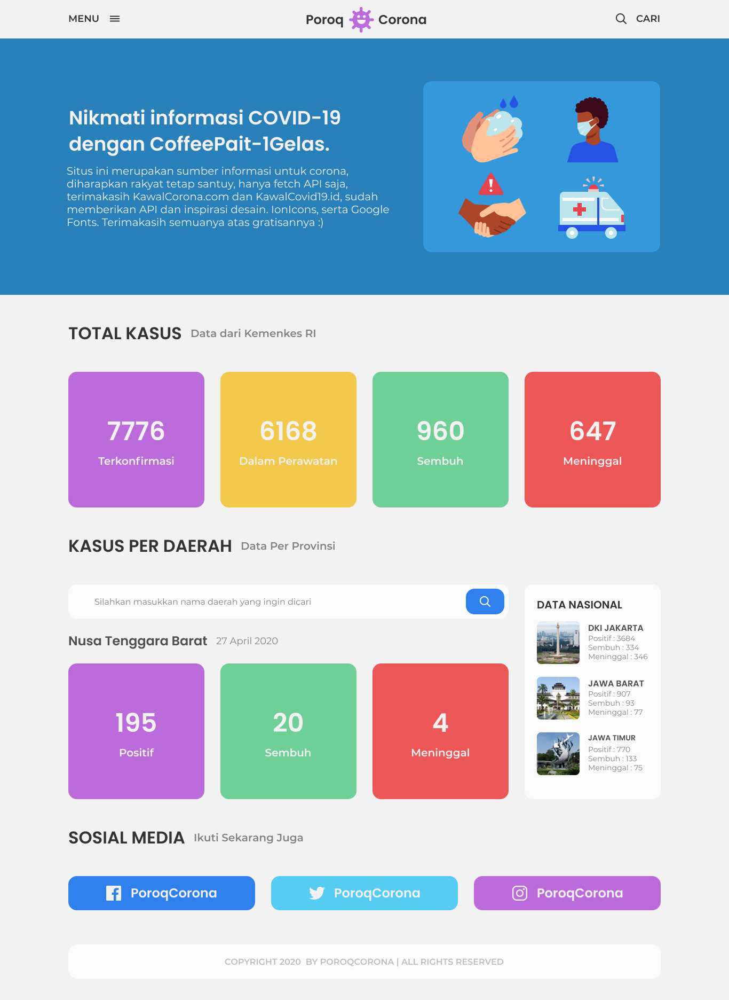

# **POROQ CORONA || COVID-19 TRACKER**

## **Features**

- Real Time data
- Rangkuman kasus dari seluruh Indonesia
- Fitur searching untuk tiap daerah
- SCSS Supported (BEM Methodology Class)

## **Minus**

- Gambar pada sidebar Data Nasional tidak update sesuai daerah
- Navbar belum diisi kontent (Masih 1 Pages)
- Belum fitur pencarian pada navbar (1 Page juga heuehu)

Website ini adalah website untuk melakukan pengecekan terhadap pandemi COVID-19 di Indonesia.

**Untuk API didapat dari**

- Kawalcovid19.id (rangkuman)
- Kawalcorona.com (per daerah)

**Untuk Icons didapat dari**

- Ionicons.com

**Untuk fonts didapat dari**

Google Fonts :

- Poppins
- Montserrat

**Untuk Warna didapat dari**

- Flatuicolors.com

**Keterangan**

> Ini adalah website pertama yang saya buat menggunakan Vanilla Javascript
> Jadi jika ada kekurangan itu dari saya semata, jika ada kelebihan itu dariNya semua.
> Much Love & Respect

#### **Bung Apenk - PenkSantuyyy**
